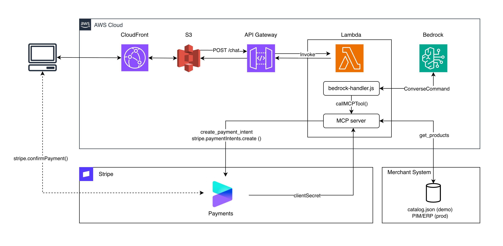

# Onsite Agent on AWS

An agentic commerce reference implementation — a conversational shopping assistant that runs entirely in the browser, powered by AWS Bedrock (Claude), MCP tools, and Stripe.

Customers chat with an AI assistant that understands intent, browses a product catalog, and completes checkout — including the Stripe Payment Element — without leaving the chat interface.

Built as a starting point for teams who want to explore agentic commerce on AWS.

---

## Architecture overview



**Browser → CloudFront + S3** — The chat UI is a static Next.js export served from S3 via CloudFront. No server required for the frontend.

**Browser → API Gateway → Lambda** — Every chat message is a `POST /chat` to API Gateway, which invokes the Lambda function.

**Lambda → Bedrock** — The Lambda handler sends the conversation to AWS Bedrock (Claude) using the `ConverseCommand` API. Claude decides which tools to call based on the user's message.

**Lambda → MCP Server** — The MCP server runs as an embedded stdio subprocess inside the same Lambda. When Bedrock calls a tool (`get_products`, `configure_product`, `create_payment_intent`), the handler routes it to the MCP server and returns the result back to Bedrock.

**MCP Server → Merchant System** — `get_products` reads from `catalog.json` in the demo. In production this is where you connect your PIM, ERP, or product API.

**MCP Server → Stripe** — `create_payment_intent` calls the Stripe API and returns a `clientSecret` to the browser.

**Browser → Stripe** — The browser uses the `clientSecret` to render the Stripe Payment Element and calls `stripe.confirmPayment()` directly. Payment confirmation never touches your Lambda.

**Key design decision:** The MCP server is embedded inside the Lambda — the entire backend is a single deployable unit with no separate service to provision.

---

## Deploy

### Prerequisites

- [AWS CLI](https://docs.aws.amazon.com/cli/latest/userguide/install-cliv2.html) configured with credentials (`aws configure`)
- [SAM CLI](https://docs.aws.amazon.com/serverless-application-model/latest/developerguide/install-sam-cli.html)
- Node.js 20+
- AWS Bedrock model access enabled for Claude in `us-east-1`
- A [Stripe](https://stripe.com) account (test mode is fine)

### Option A — Setup wizard (recommended for first deploy)

```bash
cd setup
npm install
npm run dev
```

Open [http://localhost:3001](http://localhost:3001). The wizard walks you through:
1. Store name and AI persona
2. Stripe keys
3. AWS region and stack name
4. One-click deploy

The wizard writes `mcp-server/catalog.json` and `infrastructure/samconfig.toml`, then runs `deploy.sh` for you.

### Option B — Deploy directly

**Step 1 — Store your Stripe secret key in SSM**

```bash
aws ssm put-parameter \
  --name "/onsite-concierge/stripe-secret-key" \
  --type SecureString \
  --value "sk_test_YOUR_KEY"
```

**Step 2 — Run the deploy script**

```bash
cd infrastructure
./deploy.sh
```

On first run, SAM will prompt for stack parameters (store name, persona, Stripe publishable key, model). On subsequent runs it reads from `samconfig.toml`.

The script builds the backend, deploys the SAM stack, builds the Next.js frontend, syncs it to S3, and invalidates CloudFront. Your app is live at the CloudFront URL printed at the end.

---

## Customise

### Product catalog

Edit `mcp-server/catalog.json` directly. This is the single source of truth for what the AI can sell.

```json
{
  "storeDescription": "Your store description",
  "currency": "usd",
  "quickPrompts": ["..."],
  "products": [
    {
      "id": "product-001",
      "name": "Product Name",
      "description": "What it is",
      "price": 29.99,
      "category": "category-name",
      "imageUrl": "https://...",
      "options": {
        "colors": ["Black", "White"],
        "models": ["Option A", "Option B"]
      }
    }
  ]
}
```

The `category` field is used by the AI to filter products — when a user asks for something in a specific category, the AI calls `get_products(category="...")` and only the matching products are returned.

Redeploy after editing the catalog (`./deploy.sh` from `infrastructure/`).

### AI persona and behaviour

The system prompt is in `aws-backend/src/bedrock-handler.ts` in the `buildSystemPrompt()` function. Edit it to change how the AI introduces itself, what tone it uses, and how it handles edge cases.

### AI model

Change `BedrockModelId` in `infrastructure/samconfig.toml`:

| Model | ID | Notes |
|-------|----|-------|
| Claude Haiku 4.5 *(default)* | `us.anthropic.claude-haiku-4-5-20251001-v1:0` | Fast, cost-effective |
| Claude Sonnet 4.6 | `us.anthropic.claude-sonnet-4-6-20250514-v1:0` | Better reasoning, higher cost |

### Adding a new MCP tool

MCP tools are what the AI can *do* — browse products, configure a selection, create a payment, verify status. To add a new capability (e.g. check order status, apply a discount code):

1. Open `mcp-server/src/index.ts`
2. Add a new `server.registerTool(...)` block following the existing pattern
3. Add the corresponding tool spec to `BEDROCK_TOOLS` in `aws-backend/src/bedrock-handler.ts` so Bedrock knows it exists
4. Redeploy

```typescript
// mcp-server/src/index.ts
server.registerTool(
  "check_order_status",
  {
    title: "Check Order Status",
    description: "Look up the status of an order by order ID",
    inputSchema: {
      orderId: z.string().describe("The order ID to look up"),
    },
  },
  async ({ orderId }) => {
    // Call your OMS or database here
    return {
      content: [{ type: "text", text: `Order ${orderId}: shipped` }],
      structuredContent: { orderId, status: "shipped" }
    };
  }
);
```

### Connecting real product data

In production, replace the `catalog.json` file read in `mcp-server/src/index.ts` with an API call to your PIM, ERP, or product database. The `get_products` tool is the integration point.

---

## Project structure

```
├── chat-frontend/          # Next.js chat UI (S3 + CloudFront)
│   └── src/
│       ├── components/     # Chat, messages, product cards, payment form
│       └── lib/            # API client, types, utilities
│
├── aws-backend/            # Lambda function
│   └── src/
│       └── bedrock-handler.ts   # Bedrock ConverseCommand + MCP tool loop
│
├── mcp-server/             # MCP tools (runs inside Lambda)
│   ├── src/index.ts        # Tool definitions: get_products, configure_product, create_payment_intent
│   └── catalog.json        # Product catalog — edit this to change what's for sale
│
├── infrastructure/
│   ├── template.yaml       # SAM template (Lambda + API Gateway + S3 + CloudFront)
│   └── deploy.sh           # Build + deploy + frontend upload in one script
│
└── setup/                  # Local setup wizard (localhost:3001, not deployed)
    └── src/app/            # Next.js wizard UI + API routes
```

---

## Production considerations

This reference implementation uses production-grade AWS and Stripe infrastructure, but has application-layer gaps that a real deployment would need to address. These are intentionally left open — every team's existing stack will handle them differently.

| Area | Current state | What to add |
|------|--------------|-------------|
| **Product data** | `catalog.json` flat file — requires redeploy to update, no stock levels | Connect `get_products` in `mcp-server/src/index.ts` to your PIM, ERP, or product API |
| **Authentication** | None — anyone with the URL can start a session | Add Cognito, session tokens, or integrate with your existing auth |
| **Conversation history** | Browser `localStorage` only — lost on close, no cross-device | Store sessions in DynamoDB keyed by session/user ID |
| **Rate limiting** | None — all Bedrock and Stripe calls run at cost | API Gateway usage plans, Lambda reserved concurrency |
| **CORS** | Wildcard `*` — accepts requests from any origin | Lock to your domain in `infrastructure/template.yaml` |
| **MCP transport** | stdio subprocess spawned inside Lambda — adds ~200ms per tool call | Run MCP server as a separate service with HTTP/SSE transport for lower latency |
| **Observability** | No logging or tracing beyond basic Lambda logs | CloudWatch dashboards, X-Ray tracing, Stripe webhook event logging |
| **Custom domain** | CloudFront URL only | Route 53 + ACM certificate on your CloudFront distribution |
| **Order management** | `create_order` generates a local ID only — no OMS integration | Wire `create_order` tool in `mcp-server/src/index.ts` to your OMS after payment confirmation |

The Stripe and AWS services underneath are production-grade. The gaps above are application concerns that sit on top of them.

---

## Security

- The Stripe **secret key** is stored in AWS SSM Parameter Store (SecureString, KMS-encrypted) and fetched at Lambda runtime — it is never in environment variables or source code
- The Stripe **publishable key** is a public key, safe to include in the frontend build
- The S3 bucket is private — CloudFront uses Origin Access Control (OAC) to serve the frontend
- All traffic is HTTPS (CloudFront enforces redirect from HTTP)
- No customer data is persisted — conversation history lives only in the browser session (localStorage)
